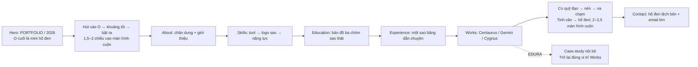

# Stellar Odyssey — Kế hoạch nâng cấp thị giác

> **Cập nhật triển khai 10/10/2026:** P1–P4 đã hoàn tất code và kiểm kỹ thuật/local theo lệnh “bắt đầu kế hoạch tinh chỉnh g1-g2”. Opening tâm→O, năm lớn/contour chậm dài, intake chuỗi+dải và comet lớn/S liên tục đã có trong bản tích hợp. **G1/G2 vẫn chờ người dùng duyệt visual lại; V9/G3 chưa bắt đầu.** Bộ V0–V11 trong [prompts.md](../prompts.md) và [phương án G1/G2](ke-hoach-tinh-chinh-g1-g2-2026-10-10.md) ưu tiên phạm vi hiện tại. [Verification mới](../outputs/visual-revision-2026-10-09/g1-g2-implementation/verification.md) · [Gallery](../outputs/visual-revision-2026-10-09/g1-g2-implementation/review.html). Nội dung 07/10 dưới đây là lịch sử; không chạy R7.2 cũ hoặc viết lại Contact/Footer.

Ngày chốt: **07/10/2026**. Nguồn quyết định: phỏng vấn `grill-me`, Q1–Q23 và các trả lời cuối của người dùng.

**Trạng thái: đã thống nhất hướng thiết kế; chưa triển khai code ứng dụng.** Tài liệu này là kế hoạch thực hiện, không phải báo cáo tính năng đã hoàn thành. Việc tải tài liệu EDURA được người dùng cho phép riêng. Các thông số nhỏ sẽ được tinh chỉnh trong prototype; các quyết định đã chốt dưới đây phải được giữ.

## 1. Ý tưởng xuyên suốt

Một trang portfolio bắt đầu bằng typography và một điểm hút nhỏ, mở ra một hành trình quan sát hố đen, khám phá năng lực và học vấn qua các vì sao, theo sao băng đến các dự án, rồi kết thúc bằng sự hình thành hố đen tại Contact.

Hố đen lớn bắt đầu xuất hiện **sau portal**, được giữ trong cảnh đến hết Experience. Sao băng dẫn camera rời hố đen khi chuyển sang Works. Camera thay đổi vị trí và hướng nhìn theo bố cục từng section: lúc làm spotlight, lúc làm nền; nội dung luôn có vùng trống đủ đọc. Hố đen không bị ép vào một vị trí cố định xuyên toàn trang.

Playground và ba marquee đã được gỡ trong checkout hiện tại; kế hoạch này không phục hồi chúng.

## 2. Ngôn ngữ thị giác và những phần giữ/bỏ

### Giữ

- Hành trình **dark cố định**, nền gốc `#050505`; chữ, sao, glow, logo biểu diễn và hố đen dùng trắng/xám/đen.
- Màu gốc của chân dung khi tương tác; màu nguyên bản của ảnh sản phẩm trong preview Works và case study.
- Lens bóp méo chữ theo chuột, cursor mono, VIEW và magnetic nhẹ tại phần tử phù hợp. Lens giữ phạm vi heading/ảnh như chức năng hiện có; không dịch chuyển hit target hoặc focus ring.
- Sao băng ngẫu nhiên trong vũ trụ, với lõi trắng mảnh và trail nhẹ; giữ nhịp thưa đã có làm điểm xuất phát để đo kiểm.
- Sound opt-in, lựa chọn ngôn ngữ Vi/En, điều hướng và những hạ tầng đã kiểm chứng.
- Chất hố đen NASA-inspired hiện có: lõi tối, đĩa bồi tụ/lensing/photon và glow chung hình dáng. Đây vẫn là mô phỏng procedural của portfolio, không tuyên bố trùng dữ liệu render NASA 100%.

### Gỡ hoặc thay thế trong đợt triển khai

- Hai panel OPTICAL SYS/GYRO ATTITUDE và toàn bộ telemetry/knurled chrome đi kèm. Khoảng trống là một phần bố cục, không cần HUD mới lấp vào.
- Theme toggle của hành trình; xử lý cả trạng thái light đã lưu và bootstrap để không lóe nền sáng sau khi chuyển sang dark cố định.
- Chòm sao trang trí cũ Taurus/Cygnus/Orion/Sagittarius. Các chòm mới có dữ liệu, vai trò và thời điểm xuất hiện riêng; Cygnus mới thuộc VIE.
- Panel kính ở About, các card/hệ vệ tinh cũ của Skills, tinh cầu xoay bên About.
- Bụi bám con trỏ toàn trang, HUD tiến độ dạng quỹ đạo, target-lock/bracket và flare amber trên dự án.
- Radio terminal, equalizer và các chi tiết giả thông số của Contact.
- Cyan/amber trong scene, liên kết, chip, glow và control; gỡ class kính tại các phần đã redesign, không chỉ xóa border bên ngoài.

### Phân biệt chuyển động nền và chuyển động dẫn chuyện

Sao băng ngẫu nhiên vẫn được giữ theo quyết định cuối của người dùng. Chỉ xuất hiện sau khi vũ trụ đã được mở ra, không làm lộ galaxy đầy đủ ở Hero ban đầu. Tạm dừng phát vệt ngẫu nhiên trong portal, đoạn sao băng dẫn chuyện Experience→Works và cao trào Works→Contact; trả lại ở những khoảng quan sát phù hợp. Trail đang có phải rút/fade mượt tại ranh giới.

Các chuyển động chủ lực phải tua ngược theo cuộn. Chuyển động nền theo thời gian được quản lý riêng và không tham gia trạng thái va chạm cần đảo chiều chính xác. Lens tạm nghỉ khi nội dung đang bị nuốt hoặc rút khỏi một chuyển cảnh để không xuất hiện một điểm méo độc lập trên màn cinematic.

## 3. Hero và portal đầu

### Bố cục

- **PORTFOLIO** sáng, sắc, gần hết chiều ngang và là điểm đọc chính.
- **2026** khổng lồ ở lớp sau, lệch xuống/phải, tối hơn nhưng vẫn đọc rõ. Giữ bốn số trong khung; chồng lớp có kiểm soát, để số 6 quan sát được.
- **TRẦN VŨ ANH DUY** nhỏ hơn, nằm trái ngay dưới PORTFOLIO. Role/tagline gọn cạnh cụm thông tin cá nhân, dùng nội dung i18n đã có.
- **O cuối cùng** của PORTFOLIO chứa mini hố đen. Chữ vẫn nhận diện được trước khi chuyển cảnh.
- Nền đầu gần đen, có bụi sáng cực mảnh và biến dạng nhẹ quanh O; chưa hiện bầu trời sao đầy đủ, hố đen lớn hoặc các chòm sao.
- Giữ heading/nội dung bằng DOM để có semantic, i18n và lens hiện hữu; Canvas phụ trách mini hố đen và hiệu ứng không gian.

### Glitch năm

Mỗi **1,5 giây**, riêng số **6** lóe thành **7** khoảng **80–120ms** rồi khớp lại thành 6. Glitch cục bộ, mono; các số 202 và khung hình giữ ổn định. Dừng khi Hero ra khỏi vùng nhìn, khi portal đang diễn hoặc khi reduced-motion bật. Accessible text vẫn là năm chính 2026.

### Chuyển cảnh — 1,5–2 chiều cao màn hình cuộn

1. Tiến về O cuối; bụi và nét chữ gần O bị kéo cong theo lực hút.
2. Lõi tối mở rộng nuốt khung hình; khoảng tối ngắn nối hai thang kích thước.
3. Camera bị đẩy ra từ hố đen lớn trong khi vẫn nhìn về phía nó, rồi ổn định vào bố cục About.

Tiến độ nằm trong tay người cuộn; có thể dừng hoặc đảo chiều ở mọi điểm. Không tự chạy nốt chuyển cảnh sau khi người xem đã dừng.

## 4. About — gặp con người thật

- Chỉ giữ giới thiệu bản thân: tên, vai trò, câu mở đầu, hai đoạn bio và quote phù hợp với nhịp đọc.
- Chân dung đứng tự do; bỏ panel, caption-box và vùng tinh cầu. Chọn vị trí ảnh/chữ từ các frame storyboard sao cho không che điểm sáng chủ lực của hố đen.
- Asset `public/avatar.webp` có alpha và màu, nhưng **vẫn chứa vòng sáng xanh cùng trang trí ghép sẵn**. Chuẩn bị bản cutout sạch phần người, giữ khuôn mặt/pose/trang phục; gỡ vòng/trang trí ngoại cảnh trước khi dùng bố cục tự do. Không coi xóa CSS border là đã hoàn tất bước này.
- Mặc định grayscale; hover trả màu nhẹ nhàng. Trên touch, chạm đổi trạng thái màu; keyboard có cách tương tác tương đương.
- Scramble **họ tên + một câu mở đầu** trong khoảng **0,8–1 giây** khi vào section. Hai đoạn bio hiện theo nhịp đọc và giữ chữ thật.
- Chuyển tools và core competencies sang Skills; không lặp nội dung ở cả hai section.

## 5. Skills — công cụ tạo thành năng lực

### Bố cục desktop

Ba vùng: **danh sách phần mềm → sân khấu logo sao rộng nhất → năng lực áp dụng**. Không đóng thành card lớn. Cụm kỹ năng làm việc chung và nền tảng kỹ thuật nằm gọn phía dưới.

Chỉ một tool active. Tên tools và các năng lực vẫn đọc được khi chưa tương tác. Tối đa 2–3 nhánh sáng liên quan mỗi lần, tránh biến cả section thành một lưới sáng.

### Trình tự tương tác

1. Những sao thuộc vùng nền bắt đầu dịch chuyển về vùng biểu diễn.
2. Điểm sáng tạo hình trước, liên kết xuất hiện sau để gợi cấu trúc logo.
3. Logo hoàn chỉnh rõ dần; đường sáng nối tới các năng lực tương ứng.
4. Rời hover/focus hoặc bỏ chọn: logo và liên kết tháo ngược, sao trở về vị trí gốc.

Chuyển liên tục giữa các tools phải đi từ trạng thái đang có; không chồng nhiều logo hay để hạt/đường cũ mắc kẹt. Cuộn khỏi Skills trả hệ về nền.

### Mapping đã thống nhất

| Tool | Năng lực được nối |
|---|---|
| Figma | Wireframing · Prototyping · Design Thinking |
| Photoshop | Xử lý ảnh · Compositing |
| Illustrator | Thiết kế vector · Branding/Packaging |
| After Effects | Motion Graphics · VFX |
| Premiere | Dựng phim |
| DaVinci Resolve | Dựng phim |
| AI Tools | AI-Assisted Design |

Premiere và Resolve thành hai mục riêng; asset `/icons/pr.png` hiện thực tế là hình Resolve, cần chuẩn bị icon Premiere đúng. **Không tự thêm color grading** hoặc mức thành thạo chưa được xác nhận.

Teamwork, Project Management, Time Management, Adaptability, Attention to Detail là cụm năng lực chung. HTML/CSS/JS giữ mức nền tảng, React giữ trạng thái đang học. Không tự đổi thành proficiency cao hoặc phần trăm thành thạo.

### Nhóm AI

AI Tools là một mục chung. Khi sao hội tụ, tạo ba biểu tượng **ChatGPT (GPT) · Claude · Google Antigravity**, rồi quay quanh cùng một tâm. Mỗi logo giữ hướng đọc và hình dáng nhận diện; cả nhóm tháo ngược khi bỏ chọn. Dùng asset nhận diện mono từ nguồn chính thức, không lấy Gemini thay Antigravity hay tự sáng tác logo GPT riêng.

## 6. Education — bản đồ ba nhánh học tập

Một bản đồ lớn, **ba cụm bất đối xứng**, khoảng **1,5–2 chiều cao màn hình** trên desktop. Tên trường, niên khóa và ngành học luôn hiện; các chòm sao kết tinh khi tương tác, không dùng panel bao quanh từng mốc.

| Cột mốc | Niên khóa hiện có | Chòm sao đã chọn | Cách liên hệ |
|---|---|---|---|
| Đại học Sài Gòn / CNTT | 2021–2026 | **Circinus** | Compa vẽ kỹ thuật: cấu trúc, tư duy hệ thống, độ chính xác |
| Green Academy / Dựng phim | 2022–2023 | **Telescopium** | Kính thiên văn: quan sát, ống kính, lựa chọn khung nhìn |
| Arena Multimedia | 2024–nay | **Pictor** | Giá vẽ: nghệ thuật thị giác và thiết kế |

Ba nhánh cùng tồn tại, thể hiện đúng thời gian chồng nhau; không dàn thành ba bước đào tạo loại trừ nhau. Những liên hệ ngành học là diễn giải thiết kế, không phải định nghĩa thiên văn.

Hover/focus một mốc: sao từ nền hiện rõ, hình thành chòm tương ứng. Rời mốc hoặc cuộn khỏi section: sao tan về nền. Một mốc active mỗi lần. Touch dùng chọn/bỏ chọn rõ ràng.

Các chòm này ít nổi bật ngoài trời hơn Gemini/Cygnus. Nâng độ tương phản **các sao sáng nhất trong từng vùng** là art direction; không mô tả chúng như những nhóm sao sáng nổi tiếng ngoài trời.

## 7. Experience — sao băng dẫn đường

- Một sao băng chủ lực duy nhất đi theo đường cong qua HOSANA MEDIA, UPWORK và DESIGNVELOPER.
- Đầu sao đi ngang mốc nào, công ty/vai trò ở mốc đó sáng lên. Nội dung kinh nghiệm vẫn đọc được ngoài trạng thái active.
- Trail dài, lõi mảnh, giảm sáng dần phía sau; là dấu vết của cùng một đường bay.
- Vị trí đầu sao, độ dài trail và điểm nhấn đều theo cuộn: đi ngược sẽ thu đúng vệt cũ.
- Ba công việc có thời gian chồng nhau; đường bay dẫn mắt theo bố cục, không diễn giải thành ba lần chuyển việc độc quyền.
- Cuối đoạn, sao băng bẻ vào chiều sâu; camera theo sao, hố đen rời khung, ba chòm dự án xuất hiện. Tránh một lần cắt cảnh không có dấu nối thị giác.

## 8. Works — ba hệ sao của ba dự án

| Dự án | Chòm sao thật | Cơ sở liên tưởng | Hành động |
|---|---|---|---|
| EDURA LMS | **Centaurus / Bán Nhân Mã** | Chiron, người thầy và người hướng dẫn: giáo dục | Mở case study nội bộ |
| VERIS APP | **Gemini / Song Tử** | Cấu trúc đôi: con người và kết nối | Preview; sắp ra mắt, chưa có link |
| VIE PERFUME | **Cygnus / Thiên Nga** | Dáng thanh thoát: sự thanh lịch của thương hiệu | Preview; sắp ra mắt, chưa có link |

Không nhầm Centaurus với Sagittarius. Gemini không được gán ý nghĩa lịch sử về bảo mật; Cygnus không phải biểu tượng nước hoa truyền thống. Đây là các diễn giải sáng tạo đã thống nhất.

### Hình sao và quỹ đạo

Giữ bố cục sao tương đối từ bản đồ nguồn; các điểm sáng dẫn mắt trước đường liên kết. Chòm sao không bị biến thành hình minh họa người–ngựa/thiên nga hoặc logo dự án tùy ý. Ba hệ chuyển động quanh nhau là dàn cảnh của portfolio, không tuyên bố đó là chuyển động thiên văn thật.

Ba chòm cùng hiện trong khung, quay chậm đều khi quan sát; hướng nhìn đủ ổn định để giữ hình nhận diện. Tên và đích điều khiển dễ đọc, không buộc người xem đuổi theo một chữ đang xoay.

Hover/chọn dự án: cả hệ chậm lại rồi dừng êm; chòm được chọn sáng hơn, hai chòm kia dịu xuống. Preview **ảnh gốc + tên + lĩnh vực** xuất hiện ở vùng cố định. Bỏ tương tác, quỹ đạo tiếp tục mượt. VERIS/VIE có chất lượng phản hồi tương đương, nhưng không có link/nút giả hoạt động.

## 9. Works → Contact — cao trào đảo chiều được

Khoảng **2–2,5 chiều cao màn hình cuộn**, tách khỏi khoảng xem/chọn dự án. Duy trì cùng một tâm thị giác xuyên suốt:

1. Tên/preview rút khỏi sân khấu, ba hệ sao tiếp tục quay.
2. Quỹ đạo co và tăng tốc, sao kéo thành vệt cong.
3. Các cụm cô đặc trong một **nhịp nén ngắn khoảng 8–12% tổng quãng cuộn chuyển cảnh**, rồi va chạm tại tâm.
4. Điểm lóe cục bộ mở thành tinh vân trắng–xám nhiều lớp, phủ màn hình nhưng giữ vùng tối và chiều sâu.
5. Khí cuộn trở lại đúng tâm va chạm; đĩa bồi tụ và lõi đen hình thành, Contact xuất hiện khi bố cục đã ổn định.

Nhịp nén nằm trong pha va chạm, không tự chạy bằng thời gian. Người xem dừng tại đâu, cảnh giữ đúng trạng thái tại đó. Tránh một frame trắng phẳng thay cho thể tích tinh vân.

### Quy tắc liên tục bắt buộc

- Đảo chiều ở bất kỳ pha nào phải trở lại đúng trạng thái tương ứng, không teleport camera, reseed vụ nổ hoặc chạy một animation trả ngược khác.
- Quỹ đạo idle trong Works được **chốt pha khi bắt đầu chuyển cảnh**. Giữ pha đó qua mọi lần cuộn tới/lùi của cùng lượt chuyển cảnh; về hoàn toàn Works mới tiếp tục idle. Cách này giữ được quỹ đạo sống và đoạn va chạm đảo chiều liên tục.
- Tâm va chạm chính là tâm hình thành hố đen. Camera/chữ/khí/glow dùng cùng tiến độ câu chuyện.
- Sao băng ngẫu nhiên tạm nhường sân khấu trong đoạn này; không dùng bộ random nền làm particle simulation của vụ nổ.

## 10. Contact — điểm đến rõ ràng

Hố đen lệch sang một bên, đủ lớn để quan sát. Bên còn lại là vùng tối rộng cho lời mời ngắn và **email thật lớn**.

Email giải mã một lần khi đến nơi, rồi giữ yên để thao tác. Hai hành động chính là copy email và gửi mail; kênh liên hệ còn lại gọn phía dưới, dùng link thật và nội dung i18n. Bỏ radio terminal/equalizer và thông số giả. Footer tiếp nối cùng nền tối và hệ chữ, không mở thêm một cao trào cạnh tranh.

## 11. Case study EDURA

### Hướng trình bày

Trang độc lập trong cùng website, đường dẫn dự kiến **`/projects/edura`**. Khung editorial mono, nhiều khoảng trống, ảnh sản phẩm nguyên màu đủ lớn, chú thích ngắn giải thích quyết định. Behance là liên kết tham khảo phụ.

Trình tự đọc: **tổng quan/vai trò → vấn đề → các quyết định UI → flow/artifact → kết quả có căn cứ → bài học**. Chọn nội dung có ý nghĩa, không chép nguyên một gallery dài thành trang ảnh liên tục.

Canvas nặng của hành trình nghỉ khi đọc case study. Browser Back hoặc “Trở lại dự án” khôi phục vị trí Works, trạng thái chọn/pose phù hợp và focus EDURA; không bắt xem lại intro/meteor. Mở URL case trực tiếp hoặc refresh vẫn hoạt động; nếu không có lịch sử trang chính, nút trở lại dẫn về `/#work`.

### Tài liệu đã lấy trong phiên lập kế hoạch

Nguồn: [EDURA LMS trên Behance](https://www.behance.net/gallery/241524417/Edura-LMS), project ID **241524417**, được người dùng cho phép tải.

- Đã tải **26 WebP, 24 nội dung khác nhau**, tổng **2.878.812 byte**; tất cả decode thành công ở **1400×989**.
- [Manifest nguồn/HTTP/hash](../outputs/visual-redesign-2026-10-07/edura/manifest.json).
- [Kiểm kê nội dung và giới hạn](../outputs/visual-redesign-2026-10-07/edura/inventory.md).
- [Contact sheet](../outputs/visual-redesign-2026-10-07/edura/contact-sheet.png).
- Đây là **tập tài liệu khôi phục một phần từ các URL CDN công khai đã quan sát**, không phải export đầy đủ 119 module được ghi nhận trong audit cũ. Reader Behance hiện không lấy được trang; Browser runtime của phiên bị lỗi khởi động. Không tuyên bố đã tải trọn gallery.

### Kiểm chứng nội dung trước khi xuất bản

Ảnh gồm overview EDURA, persona/vấn đề/giải pháp, nhận diện và một phần UI. Các ảnh phân tích **APMS là đối thủ**, không được trình bày như màn hình EDURA. Số gần 60% được dẫn từ nguồn OnCourse Systems, không phải kết quả nghiên cứu riêng của EDURA; câu tăng hài lòng dạng kỳ vọng không biến thành outcome đo được.

Vai trò Lead UI đã có xác nhận trong audit trước; cần tài liệu thật cho scope, quyết định cá nhân, flow và kết quả. Không đưa claim “Excellent về đổi mới UX” sang trang mới khi chưa có căn cứ. Thu thập tiếp phần UI/flow còn thiếu từ Behance hoặc file gốc ở bước chuẩn bị nội dung; không dựng thành tích hay số liệu thay thế.

Chỉ đưa các ảnh được chọn vào public ở giai đoạn triển khai, với kích thước responsive, lazy loading, width/height và alt/caption Vi/En. Giữ màu/chữ gốc của screenshot sản phẩm; chú giải portfolio dùng i18n.

## 12. Mobile, keyboard, reduced-motion và điều hướng

| Khu vực | Hành vi touch đã chốt |
|---|---|
| Skills | Chạm tool để chọn, chạm tool khác để đổi; chạm lại mục đang chọn hoặc chạm nền để bỏ chọn và trả sao về nền; sân khấu xếp dọc và vẫn đủ lớn |
| Education | Chạm mốc để hiện sao; chạm nền để bỏ chọn |
| Works | Chạm để preview; chạm lại mục đang chọn hoặc chạm nền để thu preview và tiếp tục quỹ đạo; nút riêng mở EDURA; VERIS/VIE ghi sắp ra mắt |
| Chân dung | Chạm trả màu, chạm lại về grayscale |

- Focus bàn phím cho trạng thái tương đương hover; Escape bỏ lựa chọn thích hợp; Enter chỉ thực hiện hành động có thật. Tránh đổi vị trí focus vì quỹ đạo.
- Reduced-motion: giữ nội dung, ảnh/chòm sao tĩnh, đích điều hướng và case study; bỏ hút/phóng camera, orbit, meteor bay, explosion, glitch và lens động. Không làm mất thông tin khi tắt chuyển động.
- Nav/Menu đi trực tiếp tới đúng section/pose; không ép người dùng chạy qua mọi cinematic. Mở hash, tải lại giữa trang, cuộn ngược, đổi ngôn ngữ và Browser Back đều phải được xử lý.
- Một lần chạm không vừa chọn preview vừa mở trang. Target tối thiểu 44px, focus rõ, hỗ trợ safe-area, không tràn ngang từ 320px.
- Pause khi tab hidden; offscreen dừng tác vụ không cần thiết. WebGL lỗi có nền/cảnh tĩnh phù hợp và nội dung DOM đầy đủ.

## 13. Hướng thực hiện kỹ thuật — tái dùng hạ tầng hiện có

Giữ React/Vite/Tailwind/i18n/Zustand/GSAP và **một persistent Canvas, một chủ sở hữu camera**. Không thêm thư viện hiệu ứng/router chỉ để làm lại chức năng đã có; chọn giải pháp nhỏ nhất đáp ứng route thực tế và deep link.

| Phần | Tái dùng / thay đổi dự kiến |
|---|---|
| Scene | `GalaxyScene`, quality tiers, visibility, error fallback; giới hạn thành phần theo chương |
| Camera/scroll | `CameraRig`, `cameraPath`, `useScrollProgress`, ScrollSmoother/ScrollTrigger; thay tuyến truyện theo mốc DOM, không chồng thêm camera writer |
| Hố đen | Shader/HDR target/compositor/mask hiện có; dùng chung hình render cho O và cảnh lớn |
| Neo theo DOM | `useSectionAnchor` hoặc helper hiện hữu để neo O/sân khấu sao với layout |
| Sao/meteor | `StarField`, pool `ShootingStars`; sao băng dẫn chuyện và explosion dùng tiến độ xác định |
| DOM | Hero/About/Skills/Education/Experience/Work/Contact, Nav/Menu/Cursor và audio engine; giữ hook cleanup/i18n/keyboard |

Hố đen hiện render full-screen NDC; scale mesh không tạo được mini O. Prototype cách composite/mask hình HDR vào O rồi mở ra toàn màn hình, tránh một Canvas/ray-tracer thứ hai. Khoảng tối của portal là điểm nối pose; observer shader vẫn ở ngoài chân trời, không đưa vào vùng tính toán gây NaN.

Giữ bầu sao xa có mật độ góc đều. Dùng pool sao biểu diễn có vị trí gốc/đích ổn định, xuất phát từ vùng nền để tạo cảm giác sao thực sự hội tụ; không kéo cả 24k sao vào logo. Tối ưu typed arrays/uniforms, tránh cấp phát trong `useFrame`.

Các phần độc lập theo thời gian dùng `useFrame(delta)`; chuyển cảnh dẫn chuyện dùng một progress xác định, không tích phân vật lý/random mới từng frame. GSAP đặt trong `useGSAP`, cleanup đầy đủ; chỉ animation transform/opacity cho bố cục, shader cho hiệu ứng không gian. Tuân thủ functional JSX, alias `@/`, Tailwind 4 và 3D nằm trong `src/3d/`.

Chuyển dark cố định phải xử lý cả theme-init/store/classes, giữ tương phản và không phá Sound/Lang. Giữ metadata, PWA registration, offline core, asset optimization và focus management. Sau khi thêm route/case images, rà lại SPA fallback và Workbox để không vô tình precache cả gallery chưa dùng; core portfolio vẫn dùng offline được, ảnh case tải theo nhu cầu có caching phù hợp.

## 14. Các giai đoạn triển khai và đầu ra

| Giai đoạn | Công việc | Đầu ra / điều kiện đi tiếp |
|---|---|---|
| **R0 — Chuẩn bị** | Chốt tài liệu này; baseline/hash; asset chân dung sạch, logo mono, dữ liệu sao từ nguồn, chọn/kiểm chứng nội dung EDURA | Asset inventory, content thật, danh sách giữ/bỏ; không sửa lại quyết định Q1–23 |
| **R1 — Storyboard** | Frame Hero idle, portal 3 pha, About, Skills active, Education active, Experience cuối, Works idle/hover, finale và Contact; bản mobile | Chứng minh thứ bậc chữ/cảnh và vùng đọc; dùng frame cụ thể để chỉnh camera |
| **R2 — Prototype chuyển cảnh** | Dùng lab hiện có để chứng minh portal đầu và finale; một camera, một Canvas; handoff quỹ đạo idle→scrub | Forward/reverse liên tục, ngân sách GPU đo được trước polish toàn bộ |
| **R3 — Hero/About** | Typography, glitch 6→7, mini O, portal vào About; chân dung/bio/scramble; gỡ HUD và ổn định dark | Nội dung đọc rõ, không galaxy lớn ở frame đầu, giữ lens đúng phạm vi |
| **R4 — Skills/Education** | Pool sao morph, mapping, nhóm AI, bản đồ ba chòm thật; hover/focus/touch | Một lựa chọn active, sao hồi vị trí, nội dung luôn hiện, không lưới vector trang trí |
| **R5 — Experience/Works** | Meteor dẫn qua ba mốc, rời hố đen; ba hệ sao, orbit/dừng hover, preview và trạng thái link | Hành trình nối liên tục, dễ chọn, không link giả; giữ meteor nền theo lịch sân khấu |
| **R6 — EDURA** | Chuẩn bị phần tài liệu còn thiếu; trang editorial, route, nội dung/ảnh có nguồn, back restore | Deep link/reload/back đúng; màu sản phẩm thật, không dùng competitor làm EDURA |
| **R7 — Finale/Contact** | Hoàn thiện co quỹ đạo/nén/collision/nebula/hố đen; email và hành động liên hệ | Đảo chiều giữa bất kỳ pha nào; Contact có khoảng nghỉ và CTA rõ |
| **R8 — QA/tối ưu** | Responsive, motion, keyboard/touch, locale, visibility, performance, route/PWA, build/lint | Báo cáo có screenshot/trace/số đo thật; append tiến độ AGENTS sau mỗi task thực sự xong |

R2 thực hiện sớm để giải quyết hai rủi ro chính: tính liên tục chuyển cảnh và chi phí render. Prototype được làm nhỏ trong lab/hạ tầng hiện có; không xây framework motion mới.

## 15. Tiêu chí nghiệm thu

### Thị giác và nội dung

- Hero đúng thứ bậc PORTFOLIO → năm lớp sau → tên nhỏ bên trái; O cuối là cổng; chỉ số 6 glitch ngắn, không nhiễu toàn màn hình.
- About không panel/tools/core skills/planet; chân dung sạch trang trí ngoại cảnh, trả màu được; bio đọc được ngay.
- Hố đen hiện sau portal, giữ đến Experience, framing thích ứng; glow bám đĩa và lõi vẫn tối.
- Sao sáng tạo hình trước đường nối; sáu chòm đúng dữ liệu/hình tương đối đã chọn, không thay bằng icon minh họa. Logo AI/tool rõ và mono.
- Lens và sao băng ngẫu nhiên được giữ; đúng thời điểm, không che diễn biến chủ lực.
- Works có ảnh/tên/lĩnh vực khi preview; chỉ EDURA có hành động mở case; case dùng ảnh/nội dung được xác minh.
- Contact lệch hố đen, email lớn trên vùng đọc sạch; copy/mail hoạt động, không có thông số giả.

### Chuyển động và tương tác

- Ghi frame tại progress **0 / 0,25 / 0,5 / 0,75 / 1** của cả hai chuyển cảnh, chạy ngược và so lại trạng thái chủ lực.
- Thử cuộn chậm/nhanh, đổi hướng ngay khi nén/nổ, dừng giữa pha, jump Nav, resize và reload/hash; không giật pose, teleport, reseed hoặc vệt lưu sai.
- Hover liên tục giữa nhiều tool/mốc: chỉ một logo/chòm active; bỏ chọn trả sao về nền và dọn mọi đường sáng.
- Orbit Works tự chạy khi xem, dừng êm khi khám phá; handoff vào finale không nhảy và đảo chiều không đổi pha gốc.
- Keyboard/touch có trải nghiệm tương đương; reduced-motion tĩnh vẫn đầy đủ nội dung và điều hướng.

### Responsive, hiệu năng và hồi quy

- Test **320 / 390 / 768 / 1024 / 1440 / 1920px**, portrait/landscape; 0 overflow ngang, không layout shift từ animation, không chữ/nút bị cắt; contrast nội dung đạt WCAG AA.
- Mục tiêu desktop **>120 FPS trên cấu hình high-refresh tham chiếu**, ghi rõ GPU/browser/viewport/DPR và trace trong các đoạn nặng. Mobile mục tiêu **50–60 FPS trên thiết bị thật phù hợp**, giảm tier/DPR trước; không lấy FPS desktop viewport làm bằng chứng điện thoại thật. Đây là mục tiêu triển khai, chưa được đo cho redesign.
- Hidden/offscreen pause; không tăng geometry/material/target qua các vòng mount, resize, locale, route hoặc reduced-motion. Không thêm cấp phát trong vòng lặp frame.
- `npm run build` pass; lint phần sửa không thêm lỗi; 0 console/runtime/WebGL error trong phiên kiểm chứng mới, ghi riêng warning nền nếu còn.
- EDURA URL trực tiếp, reload, Browser Back và trở lại Works đúng; Vi/En đầy đủ; Sound vẫn opt-in, dark không flash.
- Preview production xác nhận manifest/SW, offline portfolio core và caching của route/ảnh case theo phạm vi mới.

## 16. Nguồn tham chiếu

- [Locomotive — Editorial New](https://locomotive.ca/en/work/editorial-new): art direction lấy typography làm trung tâm.
- [Merci-Michel — Cartier Journey](https://mercimichel.medium.com/the-fabulous-cartier-journey-case-study-5089462d0948): dàn cảnh/camera xen kẽ cao trào và khoảng lặng.
- [Active Theory — The Field](https://medium.com/active-theory/the-field-bbe924426d7f): particle phục vụ câu chuyện, giao diện nhường không gian.
- [IAU — Constellations, figures và charts](https://iauarchive.eso.org/public/themes/constellations/): ranh giới chòm sao; nét nối không có một mẫu chính thức duy nhất. Hình sao là góc nhìn, không phải các sao vật lý gắn cùng một hệ.
- [Centaurus / Chiron — Chandra](https://chandra.harvard.edu/photo/constellations/centaurus.html).
- [Gemini — NASA](https://science.nasa.gov/solar-system/skywatching/night-sky-network/gemini-constellation/).
- [Cygnus — NASA](https://science.nasa.gov/solar-system/skywatching/night-sky-network/summer-triangle-corner-deneb/).
- [Circinus — Chandra](https://chandra.si.edu/photo/constellations/circinus.html), [Pictor — Chandra](https://chandra.si.edu/photo/constellations/pictor.html), [Telescopium — PAGASA](https://pubfiles.pagasa.dost.gov.ph/pagasaweb/files/astronomy/08%20Astro%20Diary%20Press%20Release%20August%202024.pdf).
- [OpenAI brand assets](https://openai.com/brand/), [Claude spark](https://support.claude.com/en/articles/10534883-use-the-claude-widget-on-android), [Google Antigravity press assets](https://antigravity.google/press).
- [EDURA LMS — nguồn case study](https://www.behance.net/gallery/241524417/Edura-LMS).

## 17. Ranh giới của phiên lập kế hoạch

Phiên này chỉ tạo kế hoạch, lấy và kiểm kê tài liệu EDURA, lưu bằng chứng bảo toàn nguồn, append một dòng tiến độ. Không triển khai giao diện/animation/route, không đổi dependency, không deploy và không chạy build để giả định các hiệu ứng đã pass. Các bước R0–R8 ở trên là công việc tiếp theo.
